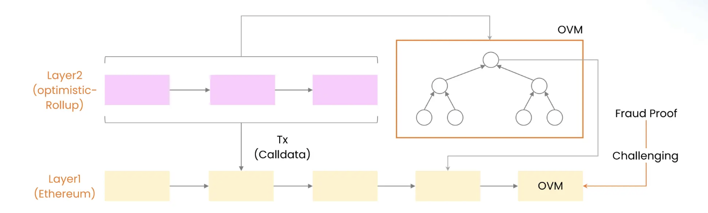
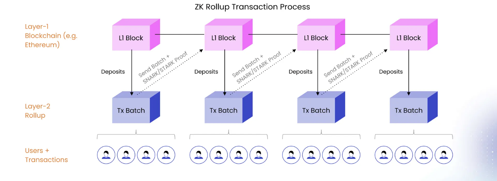

# Modular Blockchain Architecture

## Concepts

* Monolithic Vs Modular
* Scalability with Rollups
* Aggregation: AggLayer and Superchain
* Interoperability
* Value Accrual

## Monolithic Vs Modular

* **Rigid Mechanics:** Monolithic architecture refers to a system in which all of a network’s operational functions are integrated in a single protocol, followed by all operators. This includes executing transactions, coming to consensus on their order and validity, and storing the state of the chain.
* **Security vs Scalability:** Monolithic blockchains (especially bitcoin) prioritize security and decentralization over scalability, while modular blockchains were designed with scalability as a priority.
* **Bootstrapping validators:** Deploying a new monolithic blockchain requires the overhead of bootstrapping a secure validator set and maintaining a consensus network.

| Monolithic | Bitcoin, Solana, BNB       |
| ---------- | -------------------------- |
| Modular    | Ethereum, Cosmos, Polkadot |

The idea of a modular blockchain is that it can specialize in a couple of functions instead of trying to do everything. The functions that modular blockchains can specialize in are:
- **Execution:** Process transactions.
- **Settlement:** Dispute resolution and bridge (optional).
- **Consensus:** Order transactions.
- **Data availability:** Ensure data is available.

## Scaling with Rollups
Rollups are layer 2 scaling solutions where processing of transactions happens offchain but their proof or transaction data is settled on settlement layer like Ethereum. 

##### Types of Rollups Architectures
* General Purpose Rollups
* App Specific Rollups
* Sovereign Rollups

| RaaS | Gelato, Caldera, Conduit, AltLayer  |
| ---- | ---------------------------------- |

##### Types of Rollups Frameworks
Rollups range from general-purpose execution environments (e.g., [OP Mainnet](https://www.optimism.io/) and [zkSync Era](https://zksync.io/)) to app-specific rollups that host single applications.

###### Optimistic Rollups: 
* Optimistic rollups execute transactions outside of Settlement Layer, but post transaction data to Mainnet as `calldata`. 
* Assumes transactions are valid by default and only runs computation, via a **fraud proof**, in the event of a challenge.
* Optimistic rollups also use compression techniques to reduce the amount of data posted on Ethereum.
* After a rollup batch is submitted on Ethereum, there's a time window (called a challenge period) during which anyone can challenge the results of a rollup transaction by computing a fraud proof.

###### ZK Rollups: 
* runs computation off-chain and submits a **validity proof** to the main chain. 
* zk-SNARKs (Zero-Knowledge Succinct Non-Interactive Argument of Knowledge)
* zk-STARKs (Zero-Knowledge Scalable Transparent ARgument of Knowledge)

| Optimistic | Op, Arbitrum, Boba |
| ---------- | ------------------ |
| **ZK**     | zkSync, Starkware  |

##### Functions of Rollups

###### Execution Layer
* Full nodes processes new transactions from 
* Use of State Transition Function to govern the state change of blockchain with new transactions. 

###### Sequencer Layer
* **Submission and Ordering:** Accepts transactions from users and processes ordering of these transactions.
* **Soft Confirmation:** Given the deterministic nature of rollups, it provide soft confirmation of finality to user as its unlikely to have any changes in the confinement of rollup rules.
* **Block Posting:** On completion of ordering the block/batches is passed to Provers to validate.
* **Safe Escape Hatch:** For dishonest sequencers, Forced Transaction Escape Hatches can be created at rollup protocol level to enable the txn escape the sequencer and directly be posted to layer 1 

> [!info]
>Limitation of Sequencer in zk based rollup like Starknet
>
>https://community.starknet.io/t/starknet-escape-hatch-research/1108

| Shared Sequencers | Astria, Espresso, Radius, Fireblock |
| ----------------- | ----------------------------------- |

###### Proof Verification Layer
###### Data Availability Layer
###### Consensus Layer

######  Settlement Layer
 A settlement layer anchors the entire blockchain ecosystem, establishes security, and provides objective finality if a dispute occurs on another chain (optimistic rollups in this case) that requires arbitration.

##### Architecture of Rollups

##### Rollup Contracts
There’s a “rollup contract” on the mainchain that maintains the current state of the rollup layer. This includes account balances of the users transacting on it and smart contract code of the contracts that live in it. In brief, the rollup contract keeps track of the “state root” of the transactions in the rollup layer.

##### Offchain VM
Although contracts managing the optimistic rollup protocol run on Ethereum, the rollup protocol performs computation and state storage on another virtual machine separate from the [Ethereum Virtual Machine](https://ethereum.org/en/developers/docs/evm/). The off-chain VM is where applications live and state changes are executed; it serves as the upper layer or "layer 2" for an optimistic rollup.

##### Scaling of Rollups
ollups can also act as “settlement layers” upon which other rollups are deployed. This can be useful for creating composable sub-ecosystems of rollups such as the Ethereum-centric [Arbitrum Orbit](https://arbitrum.foundation/orbit) or [Argus](https://argus.gg/)’ sector-specific gaming ecosystem.

As rollups can be stacked on top of each other, modular ecosystems can scale up with demand. This is known as fractal scaling, and it's how there can be L2, L3s, L4s, and so on.

----
##### Sources
https://www.preethikasireddy.com/post/a-normies-guide-to-rollups
https://ethereum.org/en/developers/docs/scaling/optimistic-rollups/
https://messari.io/report/the-modular-blockchain-landscape?referrer=author:stephanie-dunbar